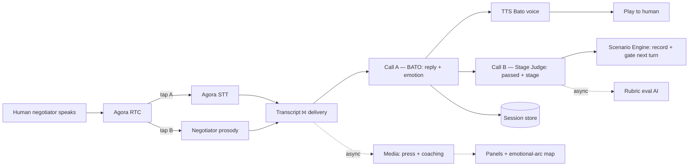

# LEVERAGE — Human Training: Layered Architecture

**Version:** 0.5 — **PIVOT to Agora Conversational AI Engine** (see callout)
**Status:** Draft
**Scope:** Human Training side only (this worktree). Agent Benchmarking is owned separately by a coworker; the shared **Scenario Engine** + scenario content is the coordination seam (§7).
**Date:** 2026-05-27

> **⚑ v0.5 PIVOT — engine/transport changed.** The project uses the **Agora Conversational AI Engine** (managed ASR + TTS + turn-taking, **OpenAI** LLM) instead of the hand-rolled direct pipeline that §3 L1 / §4 / §6 describe. Net changes:
> - **Bato (Call A)** runs inside a **custom OpenAI-compatible `/chat/completions` endpoint we host**; the engine calls it each turn, TTS's the reply, manages turn-taking. Our endpoint injects the per-stage prompt and fires **Stage Judge (Call B)** + emotion as side jobs (pushed to the frontend out-of-band).
> - **ASR + TTS + turn-taking = the engine.** Transcripts arrive over the **RTC data stream** (user + agent, with `final` flags) — not Agora Real-Time STT + our TTS.
> - **Negotiator prosody = Agora Marsview extension** over the data stream (replaces the raw-audio tap).
> - **5 BCSM stages + emotion** retained; the scaffold's 3-stage `stress_level` is superseded (may survive as a derived UI scalar).
> The per-call / per-stage *logic* (two-call, pass/fail, emotional arc) is unchanged — only **where it runs** moved. **`leverage_api_contract.md` is authoritative for the integration;** §3–§6 are kept for the layer model — read them through this callout.

---

## 0. What this version is

The human is the **sales agent / negotiator** and speaks their moves aloud. **Claude plays Bato** — it reads each human response (and *how* it was said), then returns Bato's reply, an **emotional mapping**, and the **resulting BCSM stage**. The training value is **studying Bato's emotional arc and stage progression** as a function of the human's negotiation. There is **no AI negotiator** — `negotiator-master.md` is dropped.

Two signals are captured from the human's voice (delivery prosody) and one rich signal is *generated* by Claude-Bato (emotional state + stage). Stage advancement is an **output of the Bato call**, not a separate engine step.

**Decided:** (a) the BCSM 0–15 rubric is **AI-computed** — a Claude evaluator scores the human negotiator automatically, not a human grader (§4); (b) in-world press is shown **live during the run** (not just the recap).

---

## 1. Role Mapping

| Role | Played by | Driven / guided by | Signal |
|---|---|---|---|
| **Sales Agent / Negotiator** | **Human user** | per-stage `*.player-objective.md` → shown as on-screen briefing + coaching reference | **Speaks** → STT (content) + prosody (delivery tone/pitch) |
| **Bato dela Rosa** (subject) | **Claude** | character files + per-stage base `stage-N.md` + `*.bato-agenda.md` | **Outputs** reply (→TTS) + emotional map + resulting stage |
| **Media** | **Claude** | fused transcript + human prosody + Bato emotion/stage | renders to panels |
| **Scenario Engine** | Shared service | bato scenario content | injects context, records stage trajectory |

> No AI negotiator. In Agent Benchmarking (coworker's side) the human negotiator is swapped for an autonomous agent; **Bato stays Claude**, and the same Scenario Engine + content is reused (§7).

---

## 2. Layer Stack (overview)

```
┌──────────────────────────────────────────────────────────────────────┐
│  L0  CLIENT / PRESENTATION (Browser)                                   │
│      mic capture (human negotiator) · Bato audio playback              │
│      player-objective briefing · live transcript · stage indicator     │
│      BATO EMOTIONAL-ARC MAP · negotiator delivery panel                │
│      MEDIA press panel · coaching panel · end-of-session report        │
├──────────────────────────────────────────────────────────────────────┤
│  L1  REAL-TIME TRANSPORT & CAPTURE  (Agora)                            │
│      RTC channel ── human (negotiator) audio in ── Bato TTS out        │
│      tap A → Agora Real-Time STT        tap B → Agora Raw Audio Data    │
├──────────────────────────────────────────────────────────────────────┤
│  L2  PERCEPTION / SIGNAL EXTRACTION                                     │
│      transcript assembler (partial→final, ts)                          │
│      negotiator prosody extractor (F0/pitch, energy, rate → delivery)  │
│      fusion (transcript ⨝ prosody)                                     │
├──────────────────────────────────────────────────────────────────────┤
│  L3  INTELLIGENCE / AGENTS  (Claude)                                    │
│      ┌ critical path ┐         ┌──────── async ────────┐               │
│      │ BATO (Claude): │        │ Media (press)          │              │
│      │  reply +       │        │ Media (coaching)       │              │
│      │  emotion +     │        │ Rubric eval (Claude AI) │              │
│      │  stage         │        └───────────────────────┘               │
│      └────────────────┘                                                │
│      Scenario Engine: inject context · record stage trajectory         │
├──────────────────────────────────────────────────────────────────────┤
│  L4  OUTPUT / TTS & FEEDBACK RENDERING                                  │
│      Bato TTS · emotional-arc map · delivery panel · press · coaching  │
├──────────────────────────────────────────────────────────────────────┤
│  L5  SESSION STATE & DATA                                               │
│      transcript · negotiator prosody ts · Bato emotion ts · stage ts   │
│      media log · AI rubric score · session record (JSON)         │
└──────────────────────────────────────────────────────────────────────┘
```

---

## 3. Layers 0–2 (capture & perception)

### L0 — Client / Presentation
Evolves `leverage_ui.html`. Responsibilities:
- Capture the human **negotiator's** microphone audio; play **Bato's** TTS reply.
- Render: the current-stage **player-objective briefing** (what the negotiator should aim for), live transcript, BCSM stage indicator, the **Bato emotional-arc map**, a **negotiator delivery panel** (their tone/pitch), Media **press** + **coaching** panels, and the post-run report.

### L1 — Real-Time Transport & Capture (Agora)
- Agora **RTC** carries the human's audio in. **Bato's TTS is played to the human's local output only — not pushed back into the channel** (half-duplex), which sidesteps the STT-echo class of bugs entirely.
- **Two taps off the human (negotiator) audio stream:**
  - **Tap A — Agora Real-Time STT:** PCM → transcript (Protobuf over data stream; partial → final). *Transcribe only the human's `uid` — don't re-transcribe Bato's TTS, or it echoes into the transcript.*
  - **Tap B — Agora Raw Audio Data API:** raw PCM frames → L2 prosody extractor. Negotiator delivery channel.
- Agora is **transport + frame access only**.

### L2 — Perception / Signal Extraction
- **Transcript assembler:** STT partials → finalized, timestamped negotiator utterances.
- **Negotiator prosody extractor:** PCM → features (F0/pitch, energy, rate) → a short delivery summary (e.g., *calm/measured* vs *rushed/theatrical*). **Voice prosody only.** Providers: Marsview (Agora marketplace) or DIY openSMILE/librosa. *Avoid Hume EM API — sunsetting 2026-06-14.*
- **Fusion:** transcript turn + its prosody summary → handed to Claude-Bato so Bato reacts to *how* the negotiator spoke (a theatrical/pressuring tone is a lose-condition trigger).

---

## 4. Layer 3 — Intelligence / Agents (Claude)

### Per-turn LLM calls — two-call design (full detail in `leverage_bato_engine_spec.md`)
LLM provider is abstracted (Claude today, OpenAI planned); "Claude" here = the configured LLM.
- **Call A — Bato (critical path):** plays Bato in character. Output = `reply` (→ L4 TTS) + `emotion` (+ optional private `internal_monologue`). Context = character files (`bato-character-profile.md`, `bato-biography-loyalty.md`, `bato-senate-absences.md`) + active `stage-N.md` + `stage-N.bato-agenda.md` + transcript window + negotiator utterance + delivery summary.
- **Call B — Stage Judge (concurrent with TTS playback, OFF the reply path):** a neutral evaluator. Output = `stage{current, passed, moved, evidence}` + `catastrophic_event?`. Reads the completed exchange against stage-*N* win/lose conditions; resolves before the next turn, so it never delays Bato's audio.
  - **Why split:** an in-character (resistant, face-saving) Bato is incentive-misaligned to declare his own stage passed. Separating roleplay (A) from verdict (B) keeps the reply honest and the verdict neutral.
  - **`stage.passed`** = the win condition for stage *N* is genuinely met; it is binary and **gates progression** (advance on the next turn). Distinct from the rubric's 0–3 technique-quality score: a negotiator can pass with imperfect technique or fail outright. The stage indicator marks passed/failed live.
  - **Stage authority sits with the Judge (LLM), no human referee.** Structured output enforced per provider (tool-use / function-calling / JSON-schema); on parse failure the Scenario Engine falls back to **stage unchanged + log error**.
- **Scenario Engine:** injects stage context into Call A; feeds Call B the stage's win/lose conditions; records `emotion` + `stage` into the timeseries; surfaces the current `player-objective` to the human briefing.

### Async (off the fused stream — must NOT block the turn loop)
- **Media — press reaction:** diegetic news/press blurbs reacting to developments, **streamed to the live press panel during the run** (also recapped at the end).
- **Media — coaching:** explains to the human *how their move and delivery drove Bato's emotion + stage* — e.g., "your pacing was rushed; Bato's fear spiked and he held at Stage 1." Ties the negotiator's prosody to Bato's emotional response.
- **Rubric eval (AI-computed):** a dedicated **Claude evaluator** computes the BCSM 0–15 (`scoring-overview.md`) on the **human negotiator's** technique — fully automated, **no human grading** (PRD's "human override" is out of scope here). Async, end-of-stage + end-of-session. Matches the original bato-files framing (rubric scores the negotiator).

---

## 5. The Two Emotion Signals & Bato's Arc

| Signal | Source | Role |
|---|---|---|
| **Bato's emotional map** | Claude-Bato `emotion` output (per turn) | **The study object.** Plotted as the emotional arc across the session. |
| **Negotiator delivery** | Human-voice prosody (Tap B) | How the negotiator *sounds*; fed into Bato (so tone affects his reaction) and surfaced in coaching. |

**Bato's expected arc** (the reference the emotional-arc map is read against — is the human moving him along it?):

| Stage | Expected Bato state |
|---|---|
| 1 Active Listening | Guarded, hypervigilant, testing |
| 2 Empathy | Exposed, relief + fear, softening |
| 3 Rapport | Invested, exploring, protective of allies |
| 4 Influence | Resolve building, fear lifting, "when" language |
| 5 Behavioral Change | Scared but resolved, finality, committed |

The arc map plots Bato's generated emotion over time against this reference; stage markers show where he advanced/held/retreated. Coaching narrates *why*, citing the negotiator's moves + delivery.

---

## 6. Per-Turn Data Flow & Latency Budget



**Critical path = STT → Fuse → Call A (Bato) → TTS → playback.** We drive the LLM directly, so **we own this budget**: STT finalization + Bato generation + TTS synthesis. **Call B (Stage Judge) runs concurrently with TTS playback**, off the reply path, and resolves before the next turn — so the two-call design adds **no perceived latency**. Media and the rubric run async and never add per-turn latency.

**Loop** until outcome: surrender · partial · disengaged/failed. Then the report renders in L4 (transcript + Bato emotional-arc map + stage trajectory + press recap + the AI-computed 0–15 rubric).

---

## 7. Coordination Seam — Scenario Engine Interface

Human Training and Agent Benchmarking **share one Scenario Engine + scenario content**:

```
Scenario Engine (shared service)
  load_scenario(scenario_id) -> ScenarioContext        # bato files: character + stage defs
  inject_context(stage) -> bato_prompt_fragments        # base stage + bato-agenda
  player_brief(stage) -> player_objective               # surfaced to the human negotiator
  record_turn(emotion, stage) -> void                   # appends to timeseries
  outcome() -> "surrender" | "partial" | "disengaged" | "failed" | null
```

- **Human Training**: human = negotiator (briefed by `player-objective`), Claude = Bato (driven by `bato-agenda` + stage files).
- **Agent Benchmarking** (coworker): negotiator = autonomous agent; **Bato stays Claude**; same engine + content + (if used) the BCSM rubric — enabling the human-vs-agent comparison from `app-demo-architecture.md`.

---

## 8. Session State & Data (L5)

```json
{
  "session_id": "uuid",
  "mode": "human-training",
  "human_plays": "negotiator",
  "scenario": "bato-dela-rosa",
  "date": "2026-05-27T12:00:00Z",
  "final_stage_reached": 3,
  "outcome": "disengaged",
  "transcript": [ {"speaker": "negotiator|bato", "text": "...", "ts": "..."} ],
  "negotiator_prosody_ts": [ {"ts": "...", "pitch_hz": 0, "energy": 0, "rate": 0, "delivery": "rushed"} ],
  "bato_emotion_ts": [ {"ts": "...", "primary": "fear", "intensity": 0.7, "valence": -0.4} ],
  "stage_ts": [ {"ts": "...", "stage": 2, "passed": true, "moved": "advanced", "evidence": "..."} ],
  "media_log": [ {"ts": "...", "type": "press|coaching", "content": "..."} ],
  "rubric_score": { "per_stage": [], "total_15": null }
}
```

---

## 9. Technology Choices

**Locked:**
- **Agora** — RTC transport, Real-Time STT (negotiator content), Raw Audio Data API (negotiator delivery prosody).
- **LLM (provider-abstracted — Anthropic Claude today, OpenAI planned)** — Call A Bato (reply + emotion), Call B Stage Judge (stage + passed), Media (press + coaching), AI rubric. The output *schema* is the contract; the provider is a swappable config behind an LLM port.
- **Delivery signal = voice prosody only** (no video/facial).
- **No AI negotiator** — `negotiator-master.md` dropped.

**TBD (not load-bearing for the layering):**
- **Prosody provider** — Marsview (Agora marketplace) vs. DIY openSMILE/librosa. *Not* Hume EM API (sunsetting).
- **TTS provider** for **Bato's** voice — Filipino accent, calm/measured with an edge of tension, heavier when defensive, warmer in rapport (`app-demo-architecture.md` §Voice). ElevenLabs / Azure Neural / Cartesia.
- *(Rubric scoring is decided: AI-computed human 0–15, §4 — no longer open.)*

---

*End of v0.3. The emotional arc + stage trajectory of Bato is the primary output; the human negotiator's delivery is captured and fed into both Bato and the coaching layer.*
